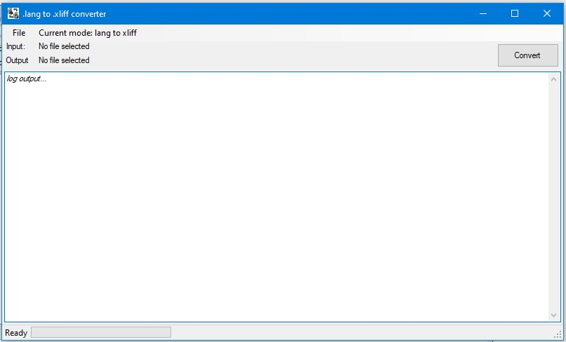
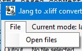
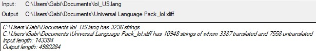
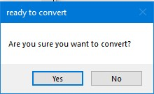
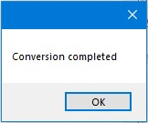

# lang to xliff converter
A WinForms based converter from Minecraft .lang to Crowdin .xliff

## How to use
### Prerequisites
1. Any .lang File
2. A .xliff (preferably obtained from Crowdin) of the same language and with at least 1 matching translation key.
### The steps
1. Go to "Open files" in "File" menu item

or just click on "Convert" button. After accepting any popups, a file dialog will appear twice.
2. Select input file and output file from "Open file" dialogs.

Information about the selected files, the detected translation count and non-space char length will be shown on screen
3. Click on convert button. A popup will appear:

**BE AWARE THAT THE CONVERSION TAKES A LONG TIME TO COMPLETE** (about 10min for a 10000 string file with 3000 matching strings)
4. Wait. If any errors appear please make sure the 1st file is a .lang and the 2nd is a .xliff (see prerequisites section)
5. If no errors appear, A popup dialog saying "Conversion completed" will appear.

